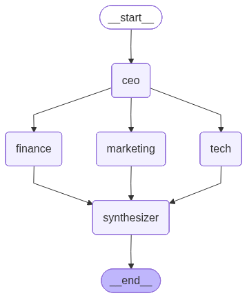

# Multi-Agent Startup Builder

A multi-agent AI system that turns a one-line startup idea into a full,
investor-ready business plan. Built with **LangGraph**, **LangChain**, and
**Streamlit** — pluggable LLM backend (Groq or OpenAI).

Five specialized agents — **CEO, Marketing, Finance, Tech**, and a final
**Synthesizer** — collaborate in a directed graph. The CEO sets the strategic
foundation, then the three specialist agents run **in parallel**, each
building on the CEO's analysis. A synthesizer agent merges their outputs
into a single polished executive brief.

---

## Architecture

The graph is a classic **fan-out / fan-in** pattern. The CEO node runs first
and seeds the shared state. LangGraph then schedules Marketing, Finance, and
Tech **concurrently** and only triggers the Synthesizer once all three have
written their results back to state.

See [`example_output.md`](example_output.md) for a full sample run.

## Features

- **5 role-based agents** with carefully engineered system prompts
- **Parallel execution** via LangGraph's stateful graph (real concurrency,
  not a hard-coded chain)
- **Streaming UI** that shows each agent's progress as it completes
- **Markdown export** of the final business plan
- **Pluggable LLM backend** — switch between Groq (free) and OpenAI in a
  dropdown; works with `llama-3.3-70b`, `gpt-4o`, and others

## Tech Stack

| Layer         | Tool                                              |
| ------------- | ------------------------------------------------- |
| Orchestration | LangGraph                                         |
| LLM (free)    | Groq — `llama-3.3-70b-versatile`                  |
| LLM (paid)    | OpenAI — `gpt-4o` / `gpt-4o-mini`                 |
| Framework     | LangChain                                         |
| UI            | Streamlit                                         |
| Lang          | Python 3.10+                                      |

## Quickstart

~~~bash
git clone https://github.com/<your-username>/multi-agent-startup-builder.git
cd multi-agent-startup-builder

python -m venv .venv && source .venv/bin/activate
pip install -r requirements.txt

cp .env.example .env
# edit .env and add your OPENAI_API_KEY

streamlit run app.py
~~~

Then open http://localhost:8501.

You can also drop your API key directly into the sidebar instead of using
a `.env` file.

## Example

**Input**

> An AI co-pilot for college students that turns their lecture recordings
> into searchable notes, flashcards, and quizzes.

**Output (truncated)**

- **CEO** — drafts a vision, problem framing, TAM, and 6-month priorities.
- **Marketing** — designs a TikTok-led GTM with campus ambassadors and
  Product Hunt launch.
- **Finance** — lays out tiered pricing, a Year-1 revenue forecast, runway
  needs, CAC/LTV targets.
- **Tech** — picks a Next.js + FastAPI + Whisper + pgvector stack with a
  30-day MVP roadmap and a 10k-user scale plan.
- **Synthesizer** — merges everything into a single investor-ready brief
  you can paste into a deck.

## Project Structure

~~~
multi-agent-startup-builder/
├── agents/
│   ├── __init__.py
│   ├── base.py            # shared LLM factory
│   ├── ceo.py             # CEO agent
│   ├── marketing.py       # CMO agent
│   ├── finance.py         # CFO agent
│   ├── tech.py            # CTO agent
│   └── synthesizer.py     # final-brief agent
├── graph/
│   ├── __init__.py
│   ├── state.py           # TypedDict shared state
│   └── workflow.py        # LangGraph DAG
├── app.py                 # Streamlit UI
├── requirements.txt
├── .env.example
└── README.md
~~~

## How It Works

1. The user enters a startup idea in the Streamlit UI.
2. LangGraph initializes shared state (a `TypedDict`).
3. The **CEO** node runs first, writing `ceo_analysis` to state.
4. LangGraph fans out to **Marketing**, **Finance**, and **Tech**, which
   each read the CEO output and write their own state field.
5. Once all three branches finish, LangGraph triggers the **Synthesizer**,
   which reads every field and writes the final brief.
6. The UI streams updates after each node completes, then renders the
   final report at the top and individual agent outputs in tabs.

## Extending It

- **Add agents** — drop a new module in `agents/` and register it in
  `graph/workflow.py`. Easy adds: Legal, HR, Ops, Investor-Pitch.
- **Add memory** — wire in a vector store so agents can reference past
  conversations or competitor intel.
- **Swap models** — replace `langchain_openai.ChatOpenAI` with any
  LangChain chat model (Anthropic, Mistral, local Ollama).
- **Add evaluation** — score each agent's output with an LLM-judge for
  consistency and completeness.

## Why This Project

Built to demonstrate, end to end:

- Practical **agentic-AI patterns** — fan-out, fan-in, shared state.
- Modern **LLM orchestration** with LangGraph rather than ad-hoc chains.
- **Production-style structure** — typed state, clean module boundaries,
  no monolithic notebook.
- A complete product loop — idea → multi-agent reasoning → polished output.

## License

MIT
